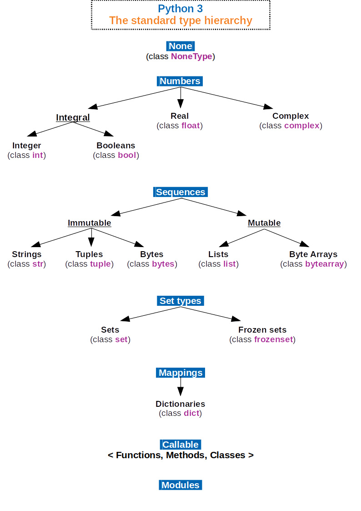

# 列表定义&迭代

## 1、python中数据类型



## 2、容器-组合数据类型-collections

| 容器类型 | 有/无顺序 | 是/否可更改 | 是否有索引 | 是否有重复成员 |
| -------- | --------- | ----------- | ---------- | -------------- |
| 列表     | 有        | 可          | /          | 允许           |
| 元组     | 有        | 不可        | /          | 允许           |
| 集合     | 无        | /           | /          | 没有           |
| 字典     | 无        | 可          | 有         | 没有           |


## 3、定义列表时注意点

1. 列表定义使用中括号[ ]
2. 列表变量最好使用复数名词 dogs = ['xiao hua','xiao hei']


## 4、示例

### 4.1、单一数据列表的定义与迭代打印

```java
'''
1.单一数据列表的定义与迭代打印
'''
students = ['zhangsan','lisi','wangwu']
for stu in students:
    print("hi," + stu.title()
```

### 4.2、混合数据定义列表

```java
'''
2.混合数据定义列表
'''
L = [1,1.2,'abc',True,(3+4j)]
print(L)
```

### 4.3、空列表

```java
'''
3.空列表
'''
LX = []
print(L)
```

### 4.4、使用list构造函数将字符串转换为单字符字符串的列表

```java
'''
4.使用list构造函数将字符串转换为单字符字符串的列表
'''
LA = list('abc')
print(LA)
```

### 4.5、使用list函数将元组转换为列表

```java
'''
5.使用list函数将元组转换为列表
'''
LB = list((1,2,3))
print(LB)
```

### 4.6、通过索引访问列表中的元素

```java
'''
6.通过索引访问列表中的元素
'''
L = ['red', 'green', 'blue', 'yellow', 'black']
print(L[0])  # red
print(L[2])  # blue
```

### 4.7、通过索引访问列表中的元素&通过title()函数获取数据

```java
'''
7.通过索引访问列表中的元素&通过title()函数获取数据
'''
dogs = ['border collie',
        'poodle',
        'german shepherd']

dog = dogs[0]
print(dog.title())
dog = dogs[1]
print(dog.title())
```

### 4.8、通过负索引值访问列表的最后元素

```java
'''
8.通过负索引值访问列表的最后元素
'''
L = ['red', 'green', 'blue', 'yellow', 'black']
print(L[-1])    # black
print(L[-2])    # yellow
```

### 4.9、通过负索引访问列表中的元素&通过title()函数获取数据

```java
'''
9.通过负索引访问列表中的元素&通过title()函数获取数据
'''
dogs = ['border collie',
        'poodle',
        'german shepherd']
dog = dogs[-1]
print(dog.title())
```

### 4.10、使用enumerate()函数迭代列表数据，既可以打印索引也可以打印数值

```java
'''
10.使用enumerate()函数迭代列表数据，既可以打印索引也可以打印数值
'''
dogs = ['border collie', 'poodle', 'german shepherd']

print("Results for the dog show are as follows:\n")
for index, dog in enumerate(dogs):
    place = str(index + 1)
    print("Place: " + place + " Dog: " + dog.title())
```

