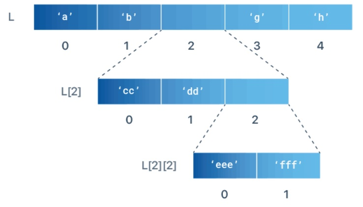
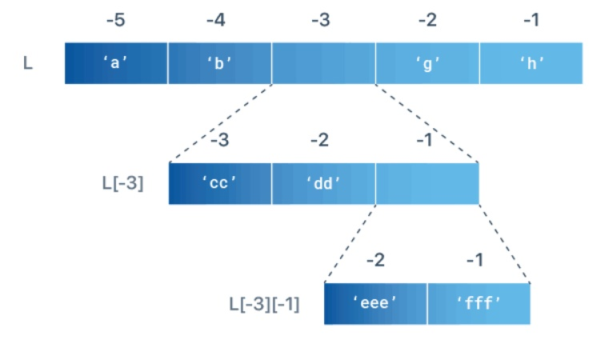

# 列表嵌套

## 1、创建一个嵌套列表

```java
'''
1.创建一个嵌套列表
每一层以逗号分隔
'''
# Example: Create a nested list
L = ['a', ['bb', ['ccc', 'ddd'], 'ee', 'ff'], 'g', 'h']
print(L)
```

## 2、按索引访问嵌套列表元素



```java
'''
2.按索引访问嵌套列表元素
'''
#Example: Access items of a nested list
L = ['a', 'b', ['cc', 'dd', ['eee', 'fff']], 'g', 'h']
print(L[2])        # ['cc', 'dd', ['eee', 'fff']]
print(L[2][2])     # ['eee', 'fff']
print(L[2][2][0])  # eee
```

## 3、嵌套列表中的负列表索引



```java
'''
3.嵌套列表中的负列表索引
'''
# Example: Access nested list items by Negative Index
L = ['a', 'b', ['cc', 'dd', ['eee', 'fff']], 'g', 'h']
print(L[-3])          # ['cc', 'dd', ['eee', 'fff']]
print(L[-3][-1])      # ['eee', 'fff']
print(L[-3][-1][-2])  # eee
```

## 4、更改嵌套列表元素的值

```java
'''
4.更改嵌套列表元素的值
'''
# Example: change item value in a nested list

L = ['a', ['bb', 'cc'], 'd']
L[1][1] = 0
print(L) # ['a', ['bb', 0], 'd']
```

## 5、将元素添加到嵌套列表

```java
'''
5.将元素添加到嵌套列表
'''
L = ['a', ['bb', 'cc'], 'd']
L[1].append('xx')
print(L)    # ['a', ['bb', 'cc', 'xx'], 'd']

L = ['a', ['bb', 'cc'], 'd']
L[1].insert(0,'xx')
print(L)    # ['a', ['xx', 'bb', 'cc'], 'd']

L = ['a', ['bb', 'cc'], 'd']
L[1].extend([1,2,3])
print(L)    # ['a', ['bb', 'cc', 1, 2, 3], 'd']
```

## 6、从嵌套列表中删除元素

```java
'''
6.从嵌套列表中删除元素
'''
L = ['a', ['bb', 'cc', 'dd'], 'e']
x = L[1].pop(1)
print(L)    # ['a', ['bb', 'dd'], 'e']

# removed item
print(x)  # cc

L = ['a', ['bb', 'cc', 'dd'], 'e']
del L[1][1]
print(L)    # ['a', ['bb', 'dd'], 'e']

L = ['a', ['bb', 'cc', 'dd'], 'e']
L[1].remove('cc')
print(L)    # ['a', ['bb', 'dd'], 'e']
```

## 7、得到嵌套列表长度

```java
'''
7.得到嵌套列表长度
'''
L = ['a', ['bb', 'cc', 'dd'], 'e']
print(len(L))       # 3
print(len(L[1]))    # 3
```

## 8、遍历嵌套列表

```java
'''
8.遍历嵌套列表
'''
L = [[1, 2, 3],[4, 5, 6],[7, 8, 9]]
for list in L:
    for number in list:
        print(number, end=' ')
```

