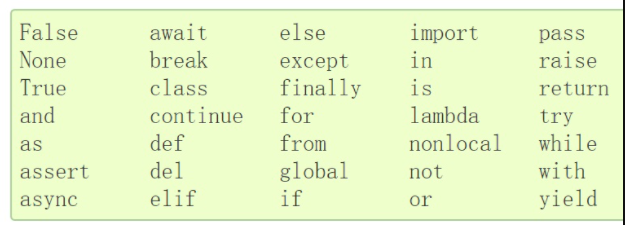

# 变量

## 1、变量命名规则

- 变量只能包含字母，数字和下划线。 变量名称可以以字母或下划线开头，但不能以数字开头。
- 变量名中不允许使用空格，可以使用下划线而不是空格。 例如，使用student_name而不是“student name”
- 不能将Python关键字用作变量名。

## 2、关键字

关键字（保留字）是 Python 语言中一些已经被赋予特定意义的单词，这就要求开发者在开发程序时，不能用这些保留字作为标识符给变量、函数、类、模板以及其他对象命名。

## 3、变量命名风格

变量名要能描述变量值的意思，最好做到"见名知义"，合理的变量名命名可以提高你程序的可读性。

命名风格可以被视为一种惯例，并非绝对与强制。

变量名一般有三种命名方式。

1. 纯小写+数字+下划线。变量名一般会采用这种方式。例如last_name
2. 驼峰体。每一个单词的首字母大写。例如：CamelCase
3. 纯大写。这一般是用来定义程序中的常量。

另外，尽量不要用拼音和中文。

## 4、变量特性

变量一共有三个特性

1. id。 变量值的内存空间地址。内存地址不同，id就不相同。可以使用id()来查看变量的内存地址。
2. type。不同类型的值记录事物的状态有所不同，这就是Python的数据类型。可以使用type()来查看。
3. 变量值。就是存储值的本身。